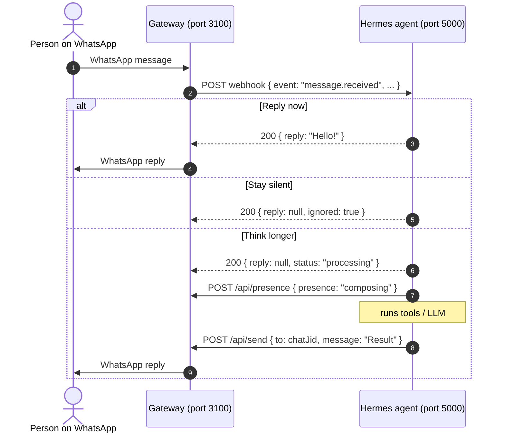

# WhatsApp Agent Hermes &bull; Integration Guide

How to connect your **Hermes agent** to WhatsApp through this gateway. Both services run on the same server; they talk over plain HTTP on localhost.

---

## 1. How it works



- The gateway never blocks on Hermes: each webhook call runs in the background with a timeout and retries.
- Reconnect duplicates are filtered, so Hermes sees each message once.
- The dashboard shows what happened to every message (sent to Hermes / replied / no reply / failed) and lets you pause forwarding with one switch.

---

## 2. Ports and `.env`

| Component | Port |
| --- | --- |
| Gateway + dashboard | `3100` |
| Hermes agent webhook | `5000` (anything you like) |

```env
PORT=3100
HOST=127.0.0.1
GATEWAY_API_KEY=

HERMES_WEBHOOK_URL=http://127.0.0.1:5000/api/webhook
HERMES_SECRET_TOKEN=change-me-to-a-long-random-string
HERMES_WEBHOOK_TIMEOUT_MS=15000
HERMES_WEBHOOK_RETRIES=2

DEFAULT_COUNTRY_CODE=60
ALLOWED_NUMBERS=
FORWARD_GROUPS=true
TIMEZONE=Asia/Kuala_Lumpur
```

Security notes:
- Keep `HOST=127.0.0.1` when Hermes is on the same machine; nothing else can then reach the gateway.
- If you must open the dashboard to the network (`HOST=0.0.0.0`), set `GATEWAY_API_KEY`. Without it, anyone reaching the port can send WhatsApp messages as you.
- Hermes should check `x-hermes-token` equals `HERMES_SECRET_TOKEN` and reject anything else with 401.

---

## 3. Webhook payload (gateway &rarr; Hermes)

```http
POST /api/webhook HTTP/1.1
Content-Type: application/json
x-hermes-token: <HERMES_SECRET_TOKEN>
```

```json
{
  "event": "message.received",
  "messageId": "3EB0ABC123456789",
  "sender": "60123456789",
  "senderName": "John Doe",
  "senderJid": "60123456789@s.whatsapp.net",
  "chatJid": "120363012345678@g.us",
  "remoteJid": "120363012345678@g.us",
  "isGroup": true,
  "groupJid": "120363012345678@g.us",
  "message": "@bot can you summarise this?",
  "messageType": "text",
  "hasMedia": false,
  "mimetype": null,
  "mentionsMe": true,
  "isReplyToMe": false,
  "quoted": { "messageId": "3EB0...", "message": "earlier text" },
  "timestamp": "08-10-2026 20:15:30",
  "timezone": "Asia/Kuala_Lumpur",
  "isoTimestamp": "2026-10-08T12:15:30.000Z",
  "rawTimestamp": 1791461730
}
```

| Field | Notes |
| --- | --- |
| `event` | `message.received`, or `test.ping` from the dashboard's **Test connection** button |
| `messageId` | WhatsApp message ID; use it for `/api/read`, `/api/media/:id` and `replyToMessageId` |
| `sender` | Phone number (digits only) or **`null`** when WhatsApp only exposes an anonymous "LID" |
| `senderName` | Push name, may be `null` |
| `chatJid` | **Where to reply.** A phone JID (`…@s.whatsapp.net`) or group JID (`…@g.us`). `remoteJid` is the same value (kept for compatibility). |
| `messageType` | `text`, `image`, `video`, `voice`, `audio`, `document`, `sticker`, `location`, `contact`, `other` |
| `message` | Text, caption, or a placeholder like `[Voice message]` |
| `hasMedia` / `mimetype` | Download with `GET /api/media/:messageId` while the message is still cached (last ~300) |
| `mentionsMe` / `isReplyToMe` | Useful in groups to only answer when addressed |
| `quoted` | The message the person replied to, if any |

Not forwarded: your own messages, status broadcasts, channels, reactions and other protocol events.

---

## 4. Hermes reply protocol

Hermes must answer the webhook with HTTP 200 within `HERMES_WEBHOOK_TIMEOUT_MS`.

### A. Reply immediately
```json
{ "reply": "Hello John! How can I help?", "quote": true }
```
`quote` (optional) makes the reply quote the incoming message; it defaults to `true` in groups and `false` in direct chats.

### B. Stay silent
```json
{ "reply": null, "ignored": true }
```

### C. Think longer, answer later
```json
{ "reply": null, "status": "processing" }
```
Then, when ready:
```bash
curl -X POST http://127.0.0.1:3100/api/presence -H "Content-Type: application/json" \
  -d '{"recipient": "<chatJid>", "presence": "composing"}'

curl -X POST http://127.0.0.1:3100/api/send -H "Content-Type: application/json" \
  -d '{"to": "<chatJid>", "message": "Here is the result…", "replyToMessageId": "<messageId>"}'
```

Anything else (non-JSON body, HTTP 4xx/5xx) is shown as **Failed** in the dashboard with the reason.

---

## 5. Gateway REST API

Base URL `http://127.0.0.1:3100`. When `GATEWAY_API_KEY` is set, send `x-api-key: <key>` (or `Authorization: Bearer <key>`) on every call except `/api/health`.

| Method & path | Body | Response |
| --- | --- | --- |
| `GET /api/health` | – | `{ success, whatsapp: "connected", uptimeSeconds }` |
| `GET /api/status` | – | Full state: status, QR data URL, user, stats, recent messages, webhook config |
| `POST /api/send` | `{ to, message, replyToMessageId? }` | `{ success: true, messageId }` |
| `POST /api/send-image` | `{ to, url, caption?, replyToMessageId? }` | `{ success: true, messageId }` |
| `POST /api/presence` | `{ recipient, presence }` | `presence`: `composing`, `paused`, `recording`, `available`, `unavailable` |
| `POST /api/read` | `{ messageId }` | Marks the message as read |
| `GET /api/media/:messageId` | – | Raw file bytes with the right `Content-Type` |
| `POST /api/forwarding` | `{ enabled }` | Pause/resume forwarding (persisted in `data/settings.json`) |
| `POST /api/webhook/test` | – | Pings Hermes with `event: "test.ping"` |
| `POST /api/connect` | – | Starts the WhatsApp connection (shows a QR if not linked) |
| `POST /api/logout` | – | Unlinks the device and wipes the saved session |

Error shape: `{ "success": false, "error": "…" }` with HTTP 400 (bad input), 401 (missing API key), 404 (number not on WhatsApp / message not cached), 502 (WhatsApp or Hermes failure), 503 (WhatsApp not connected).

`to` / `recipient` accept a phone number (`60123456789`, `0123456789` with `DEFAULT_COUNTRY_CODE`) or a JID (`…@s.whatsapp.net`, `…@g.us`, `…@lid`).

---

## 6. Example receivers

### Python (FastAPI)
```python
from typing import Optional
from fastapi import FastAPI, Header, HTTPException, Request
import httpx

app = FastAPI()
SECRET_TOKEN = "change-me-to-a-long-random-string"
GATEWAY = "http://127.0.0.1:3100"

@app.post("/api/webhook")
async def whatsapp_webhook(req: Request, x_hermes_token: Optional[str] = Header(None)):
    if x_hermes_token != SECRET_TOKEN:
        raise HTTPException(status_code=401, detail="Unauthorized")
    p = await req.json()

    if p.get("event") == "test.ping":
        return {"ok": True}

    text = (p.get("message") or "").lower()
    if p["isGroup"] and not (p["mentionsMe"] or p["isReplyToMe"]):
        return {"reply": None, "ignored": True}

    if "hello" in text:
        return {"reply": f"Hi {p.get('senderName') or 'there'}! I am Hermes."}

    # Long task: acknowledge, then reply through the API.
    async with httpx.AsyncClient() as client:
        await client.post(f"{GATEWAY}/api/presence", json={"recipient": p["chatJid"], "presence": "composing"})
        # ... run your agent ...
        await client.post(f"{GATEWAY}/api/send", json={"to": p["chatJid"], "message": "Done!", "replyToMessageId": p["messageId"]})
    return {"reply": None, "status": "processing"}
```

### Node.js (Express)
A complete demo lives in [`examples/hermes_agent_demo.ts`](examples/hermes_agent_demo.ts). Run it with `npm run demo:hermes`.

---

## 7. Run everything

1. `npm run dev` (or `npm run build && npm start`) in this folder.
2. Open [http://localhost:3100](http://localhost:3100) and scan the QR code: WhatsApp &rarr; **Linked devices** &rarr; **Link a device**.
3. Start Hermes (or `npm run demo:hermes`).
4. Press **Test connection to Hermes** on the dashboard. It must report HTTP 200.
5. Send a WhatsApp message to the linked number from another phone and watch it appear in **Recent activity** with Hermes's decision.

### Troubleshooting

| Symptom | Fix |
| --- | --- |
| "Could not reach Hermes" | Hermes is not listening on `HERMES_WEBHOOK_URL`, or the URL/port is wrong |
| "Hermes rejected the secret token" | `HERMES_SECRET_TOKEN` differs between the two `.env` files |
| Message shows **Not forwarded** | `HERMES_WEBHOOK_URL` is empty; restart the gateway after editing `.env` |
| Message shows **Paused** | Forwarding switch on the dashboard is off |
| Message shows **Filtered** | Blocked by `ALLOWED_NUMBERS` or `FORWARD_GROUPS=false` |
| QR code keeps expiring | Press **Reconnect**; the gateway stops after a few QR cycles when nobody scans |
| "Port 3100 is already in use" | Change `PORT` or stop the other process |
