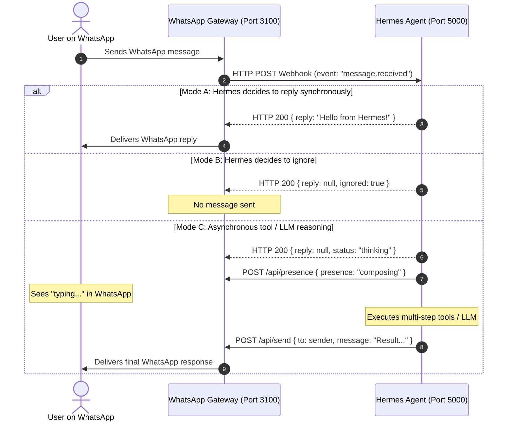

# WhatsApp Agent Hermes &bull; Complete Integration Guide

This guide details the architecture, webhook specification, API contract, and implementation steps for connecting your **Hermes Agent** with WhatsApp via this gateway (powered by [`github:JonathanChuahE-Jay/Baileys`](https://github.com/JonathanChuahE-Jay/Baileys)).

---

## 1. Architecture Overview

The system decouples the low-level WhatsApp Web protocol connection from your Hermes AI reasoning agent:



### Key Benefits
- **Zero WhatsApp Blocking**: Heavy LLM tool executions or API calls never block or desynchronize Baileys WebSockets.
- **Decision Autonomy**: Hermes can choose to reply immediately, initiate complex agent loops, or stay completely silent.
- **Message Deduplication**: WhatsApp reconnect frames are deduplicated automatically so Hermes is never triggered twice for the same message.

---

## 2. Server & Port Strategy

| Component | Default Port | Description |
| :--- | :--- | :--- |
| **WhatsApp Agent Gateway** | `3100` | Runs this Express + Baileys service and web dashboard. *(Port 3000 is reserved by local Docker services).* |
| **Hermes Agent** | `5000` (or `8000`) | Your AI agent server listening for inbound webhooks. |

### Environment Configuration (`.env`)

Configure these variables in your root [`.env`](file:///c:/Users/desmo/Desktop/whatsapp-agent-hermes/.env) file:

```env
PORT=3100
SESSIONS_DIR=./sessions

# URL where your Hermes agent is listening
HERMES_WEBHOOK_URL=http://127.0.0.1:5000/api/webhook

# Webhook request timeout in milliseconds
HERMES_WEBHOOK_TIMEOUT_MS=15000

# Shared secret token sent in x-hermes-token HTTP header
HERMES_SECRET_TOKEN=hermes_whatsapp_secret_key_2026
```

---

## 3. Webhook Specification (Gateway &rarr; Hermes)

Whenever an incoming message is received on WhatsApp (excluding self-messages and WhatsApp status broadcasts), the gateway dispatches an HTTP `POST` request to `HERMES_WEBHOOK_URL`.

### Headers
```http
POST /api/webhook HTTP/1.1
Host: 127.0.0.1:5000
Content-Type: application/json
x-hermes-token: hermes_whatsapp_secret_key_2026
```

### Inbound Payload Format
```json
{
  "event": "message.received",
  "messageId": "3EB0ABC123456789",
  "sender": "60123456789",
  "senderName": "John Doe",
  "senderJid": "60123456789@s.whatsapp.net",
  "remoteJid": "60123456789@s.whatsapp.net",
  "isGroup": false,
  "message": "Hello, can you help me check status?",
  "timestamp": "08-10-2026 20:15:30",
  "rawTimestamp": 1791461730
}
```

#### Field Reference
- `event`: String identifier (`"message.received"` for normal messages or `"test.ping"` for health checks).
- `messageId`: Unique WhatsApp message ID (used for logging and deduplication).
- `sender`: Normalized phone number (digits only, e.g. `60123456789`).
- `senderName`: WhatsApp display name (push name) if provided by sender.
- `remoteJid`: Full WhatsApp JID (`...s.whatsapp.net` or `...@g.us` for groups).
- `isGroup`: `true` if received from a group chat; `false` if direct 1-to-1 chat.
- `message`: Extracted plaintext or media caption.
- `timestamp`: Formatted timestamp in GMT+8 (`DD-MM-YYYY HH:mm:ss`).

---

## 4. Hermes Reply Protocol (3 Patterns)

### Pattern 1: Instant Synchronous Reply
If Hermes generates an answer quickly (< 10 seconds), respond directly in the HTTP body:

```json
{
  "reply": "Hello John! How can I assist you today?"
}
```
*The WhatsApp gateway will automatically send this text back to the customer.*

### Pattern 2: Ignore / Do Not Reply
If Hermes determines the message is spam, an announcement, or outside the agent's scope, return:

```json
{
  "reply": null,
  "ignored": true
}
```
*The gateway logs the status as `Ignored` and transmits nothing to WhatsApp.*

### Pattern 3: Asynchronous Tool Reasoning & Presence
If Hermes needs to query databases, search the web, or run long chains:

1. Return HTTP 200 immediately to acknowledge the webhook:
   ```json
   { "reply": null, "status": "processing" }
   ```
2. Trigger the "typing..." presence indicator:
   ```bash
   POST http://localhost:3100/api/presence
   Content-Type: application/json

   { "recipient": "60123456789", "presence": "composing" }
   ```
3. Complete the reasoning loop, then call the outbound endpoint:
   ```bash
   POST http://localhost:3100/api/send
   Content-Type: application/json

   {
     "to": "60123456789",
     "message": "Here is the result from my research..."
   }
   ```

---

## 5. Gateway REST API Reference

The WhatsApp Agent exposes these endpoints on `http://localhost:3100`:

### 1. `GET /api/status`
Returns connection state, QR code (if pending scan), active WhatsApp user, stats, and recent messages.

**Response (Sample):**
```json
{
  "success": true,
  "data": {
    "status": "connected",
    "user": { "id": "60123456789:12@s.whatsapp.net", "name": "Hermes Bot" },
    "lastConnectedAt": "08-10-2026 20:10:00",
    "stats": {
      "receivedCount": 12,
      "forwardedToHermesCount": 12,
      "hermesRepliesCount": 8,
      "sentCount": 10
    }
  }
}
```

### 2. `POST /api/send`
Sends an outbound WhatsApp text message.

**Request Body:**
```json
{
  "to": "60123456789",
  "message": "Hello from Hermes Agent!"
}
```

### 3. `POST /api/presence`
Updates the WhatsApp presence indicator for a recipient.

**Request Body:**
```json
{
  "recipient": "60123456789",
  "presence": "composing"
}
```
*Supported presence values:* `"composing"` (typing), `"paused"`, `"available"`, `"unavailable"`.

### 4. `POST /api/webhook/test`
Sends a mock ping message to `HERMES_WEBHOOK_URL` to verify connectivity.

---

## 6. Implementation Examples for Hermes Agent

### Python (FastAPI) Example
```python
from fastapi import FastAPI, Header, HTTPException
from pydantic import BaseModel
from typing import Optional
import httpx

app = FastAPI()
SECRET_TOKEN = "hermes_whatsapp_secret_key_2026"
GATEWAY_URL = "http://localhost:3100"

class WebhookPayload(BaseModel):
    event: str
    messageId: str
    sender: str
    senderName: Optional[str] = None
    message: str
    isGroup: bool

@app.post("/api/webhook")
async def handle_whatsapp(payload: WebhookPayload, x_hermes_token: Optional[str] = Header(None)):
    if x_hermes_token != SECRET_TOKEN:
        raise HTTPException(status_code=401, detail="Unauthorized")

    text = payload.message.lower()

    # Rule: Ignore messages containing "#ignore"
    if "#ignore" in text:
        return {"reply": None, "ignored": True}

    # Instant reply example
    if "hello" in text or "hi" in text:
        return {"reply": f"Hi {payload.senderName or 'there'}! I am Hermes AI."}

    # Asynchronous agent reasoning
    # 1. Trigger typing indicator
    async with httpx.AsyncClient() as client:
        await client.post(f"{GATEWAY_URL}/api/presence", json={
            "recipient": payload.sender,
            "presence": "composing"
        })

    # 2. Return HTTP 200 to acknowledge webhook
    return {"reply": None, "status": "processing"}
```

### Node.js (Express / TypeScript) Example
A fully working demo agent is included directly in this repository:
[`examples/hermes_agent_demo.ts`](file:///c:/Users/desmo/Desktop/whatsapp-agent-hermes/examples/hermes_agent_demo.ts).

Run it with:
```bash
npm run demo:hermes
```

---

## 7. How to Run Everything

### Step 1: Start the WhatsApp Agent Gateway
In the `whatsapp-agent-hermes` folder:
```bash
npm run dev
```
The server will start on [http://localhost:3001](http://localhost:3001) with live hot-reloading (`tsx watch`).

### Step 2: Connect Your WhatsApp Account
1. Open [http://localhost:3001](http://localhost:3001) in your browser.
2. If this is the first run, a QR code will be displayed on screen.
3. Open WhatsApp on your phone &rarr; **Settings** / **Menu** &rarr; **Linked Devices** &rarr; **Link a Device**.
4. Scan the QR code.
5. The dashboard will automatically update to **CONNECTED** and show your WhatsApp user ID.

### Step 3: Start Your Hermes Agent
Start your Hermes agent on port `5000` (or test with `npm run demo:hermes`).

### Step 4: Verify End-to-End
- Click **Test Ping** on the [http://localhost:3001](http://localhost:3001) dashboard.
- Send a WhatsApp message from a different phone to your linked number.
- Watch the message appear in real-time in the activity table with its webhook status (`Forwarded`, `Replied`, or `Ignored`).
